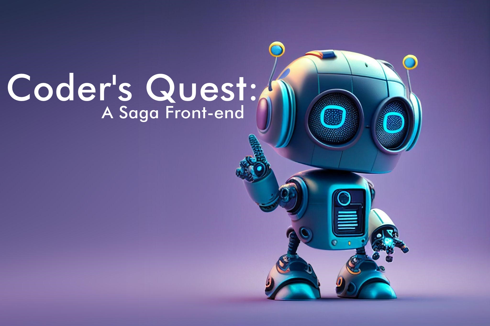

<h2 align="center">
    Preview do Podcast
</h2>

    <audio src="./assets/output/Ep01-Hello-World.MP3" controls title="Podcast"></audio>

# Projeto Podcast Gerado com Auxilio de Inteligências Artificiais

Projeto proposto no curso de "ChatGPT for Dev's" da DIO, com o objetivo de gerar um podcast utilizando ferramentas de A.I. através de prompts mais trabalhados para obter melhores respostas.

Utilizei uma esteira de prompts para gerar cada etapa do processo criativo.

## 💻 Tecnologias utilizadas no projeto

- [ChatGPT](https://chat.openai.com/) 
- [Capcut](https://www.capcut.com/pt-br/)
- [ElevenLabs](https://beta.elevenlabs.io/)
- [Sound Forge](https://www.magix.com/br/musica/sound-forge/)
- [PhotoScape](https://photoscape.softonic.com.br/)

## ✨ Como foi feito ?

- Roteiro gerado via chatgpt. ([clique aqui para ver o prompt](./assets/prompts/chatgpt.md))
- Audio gerado pela ElevenLabs para a introdução.
- Audio do conteúdo gravado por mim no Sound Forge.
- Imagens obtidas no Google e editadas no PhotoScape.
- Capcut para adicionar sons de fundo, efeitos e imagens do video.
- Vídeo pubicado no YouTube. ([clique aqui para asssitir](https://www.youtube.com))

## 👨‍💻 Expert

    
    
&nbsp&nbsp&nbsp&nbspJunior Oliveria Leandro 
    &nbsp&nbsp&nbsp
    <a 
        href="https://github.com/junior-leandro">
        GitHub
    </a>
    &nbsp;|&nbsp;
    <a 
        href="www.linkedin.com/in/junior-leandro">
        LinkedIn
    </a>
    &nbsp;|&nbsp;
    <a 
        href="https://www.instagram.com/jr_uba">
        Instagram
    </a>
    &nbsp;

  

---

Code with 💜 by [Junior](https://github.com/junior-leandro)